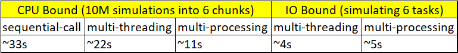

## Threading and Multiprocessing with Python
By reading through and running the python code, you'll be able to understand:

1. cpu-bound and io-bound tasks and how threads and processes work with them
2. Limitation of python's global interpreter lock

## Installation
Any of the recent python version is good enough.

## How to run
There are separate sections for cpu-bound and io-bound tasks. "cd" to threading-multiprocessing folder to run either cpu-bound or io-bound tasks.

For example, to run multi-threading and multi-processing on, say, cpu-bound tasks, "cd" to threading-multiprocessing folder and run it as a python module.

    Ex: python -m cpu-bound.multi-threading

You can compare execution time of the same function ran as a sequential, multi-threaded and multi-processed task.

Similar process can be followed for io-bound tasks.

You can test and play by changing the input for cpu-bound and io-bound tasks in utils.py

### cpu bound task
Any task that utilizes cpu for some operations is a 
cpu bound task.

In here, I have used a monte-carlo simulations to simulate
a task that uses cpu heavily. When you have for loops
running for a long doing some calculations, it becomes
cpu-intensive. This makes up for cpu-bound tasks.

### IO bound task
Any operation that makes an IO call such as reading
from a filesytem.

When a thread reads from a filesystem, it needs to
access the filesystem first and between the time of access
and computations on the file, the thread has to wait!

In here, I have simulated the thread wait using "sleep"
method making it an idea IO bound task.

### Python GIL
If we use, multi-threading in a cpu-intensive task, python cannot take advantages of multiple cores of the CPUs spawning multiple threads to get the work done in parallel. Only one thread can work at a time with context switching with other threads, causing context-switching.

Of course, threads is about concurrency but programming languages like JAVA run multiple threads on multiple cores of CPU making them parallel-in-nature. If there are multiple threads on a single core, then these threads run concurrently.

So, in a cpu-bound tasks, threads are slower compared to processors, though processors have a bit of overhead in allocating multiple system resources.

But, in io-bound tasks, because threads have to wait, other threads take up CPU meanwhile and run concurrently! 

You'll see this in action running the python modules of multi-threading and multi-processing for cpu-bound and io-bound tasks.

Here are my results on a single run:

The execution time will vary for every run depending on number of applications opened in your system, CPU cores etc. The point is: cpu-intensive tasks are faster with multi-processing relative to multi-threading in python because of GIL.

## Concurrency (Threads) vs Parallelism (Processors)
For a simple and fun way to understand
difference between concurrency and Parallelism, check this fastAPI link:

[Concurrency and Parallelism the Burger way](https://fastapi.tiangolo.com/async/#asynchronous-code)

## Future
I am exploring "uv" python package manager on 
managing python dependencies for each "nugget",
ruff for linting and other pre-commmit hooks and
will be updating about the same.